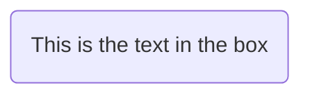

## Redis in Rust
This started as a toy project for ["Build Your Own Redis" Challenge](https://codecrafters.io/challenges/redis) it is now an attempt to do a complete re-write of Redis in Rust.

```mermaid
flowchart LR
    id1(This is the text in the box)
```